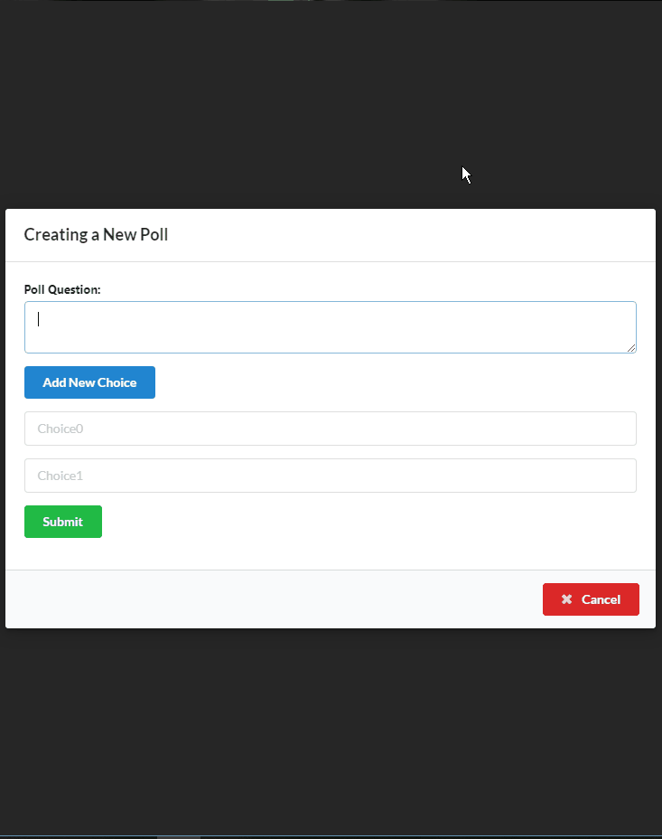
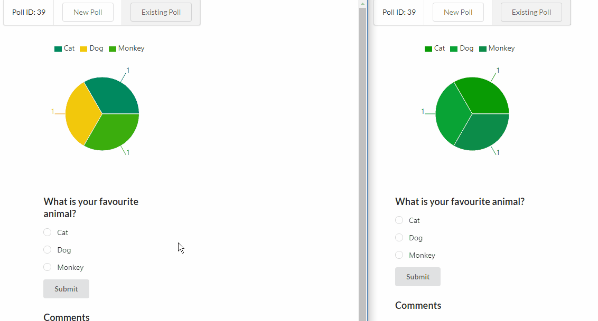
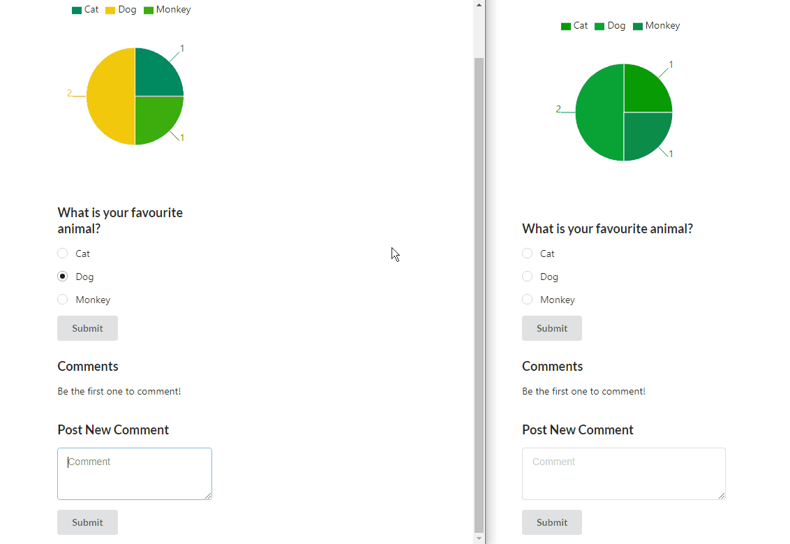

# Singular Poll

A poll application page made with React and ASP.NET Core.

Since user information is not a part of the project all polls and votes are anonymous.

## How to install


```
dotnet add package Microsoft.EntityFrameworkCore.Sqlite
dotnet add package Microsoft.EntityFrameworkCore.Design
```

```
dotnet restore
```

```
dotnet ef migrations add InitialCreate
dotnet ef database update
```

```
dotnet run
```

```
npm install
```

```
npm start
```
## Examples

### Creating a new poll.



### Opening up an already existing poll


### Voting



### Commenting

